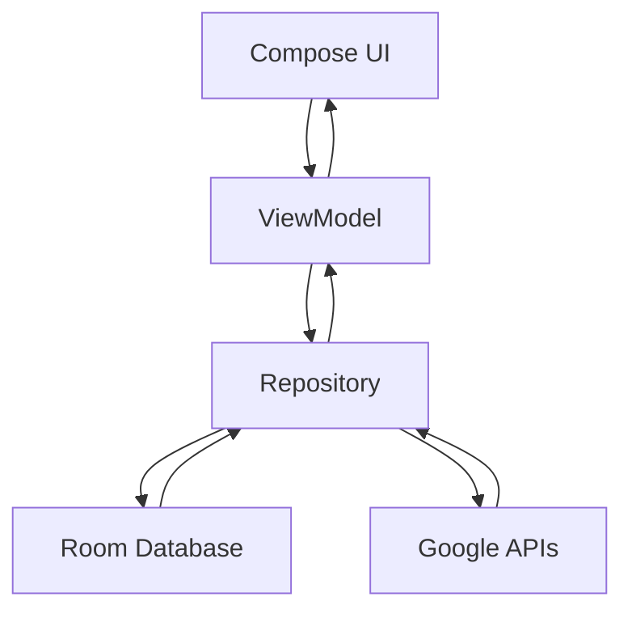

# 🛒 NearCart

## 📱 App Overview
**NearCart** is a smart shopping list Android app that helps users manage their grocery items while also discovering nearby stores in real time.

It solves two common problems:
- Forgetting what to buy while shopping  
- Not knowing the nearest store to quickly get items  

By combining a **shopping list manager + location-based store finder**, NearCart makes shopping faster and more efficient.

---

## ✨ Features

- 📝 Add, update, and delete shopping items
- 📦 Quantity & unit management (kgs, lts, pieces, etc.)
- 📍 Real-time location tracking
- 🗺 Interactive Google Maps location selector
- 🏪 Nearby grocery/store discovery using Places API
- 📏 Smart nearest store detection based on distance
- 🧭 One-tap navigation to nearest store
- 🎨 Light / Dark / System theme support
- 🔄 Swipe-to-delete with confirmation
- 📡 Pagination support for nearby places API
- 📶 Works offline for saved shopping list (Room DB)

  ### 💡 Smart UX Highlight

- ✅ Automatically sorts completed (checked) items to the bottom  
  → Keeps your active shopping items always on top  

---

## 🛠 Tech Stack

**Language**
- Kotlin

**UI**
- Jetpack Compose (Material 3)

**Architecture**
- MVVM (Model-View-ViewModel)

**Database**
- Room Database (Offline storage)

**Networking**
- Retrofit
- Gson Converter

**Location & Maps**
- Google Maps Compose
- Fused Location Provider
- Google Places API
- Google Geocoding API

**Other**
- Coroutines (async operations)
- Flow (reactive data streams)

---

## 🏗 Architecture

The app follows a clean **MVVM architecture** ensuring separation of concerns and scalability.

### Data Flow:


---

## 🏗 Layers

- **UI Layer** → Composables (Screens)  
- **ViewModel Layer** → Business logic & state  
- **Repository Layer** → Single source of truth  
- **Data Layer** → Room DB + API  

---

## 🔄 App Flow

1. App launches → asks for location permission  
2. User lands on **Home Screen**  
3. If no location is set → navigates to **Location Selector**  
4. User selects location on map  
5. App:
   - Fetches address (Geocoding API)  
   - Fetches nearby stores (Places API)  
6. User:
   - Adds shopping items  
   - Updates or deletes items  
7. App shows:
   - Shopping list  
   - Nearest store with distance  
8. User can:
   - Navigate to store via Google Maps  
   - Change location anytime

---

## 🎥 Demo Video

> YouTube

```md
https://youtu.be/4nP43BVoWcs
```

> Demo Clips

<p>
<b>Current location fetching</b>

https://github.com/user-attachments/assets/0e72c3e6-ae51-4e4d-a3a5-2c80637bb0dd

<b>Light and dark theme map with Google Map navigation</b>

https://github.com/user-attachments/assets/11b91490-1a28-4e76-9b13-3d446d184a6f

<b>Navigation from different location to nearby shop</b>

https://github.com/user-attachments/assets/1910a207-2ae7-489b-8ab8-2d1b9e84edb1

<b>Nearby shop changes according to user's current location</b>

https://github.com/user-attachments/assets/83341bdd-5922-4e97-b804-45b65a3dcecf

<b>Theme toggle</b>

https://github.com/user-attachments/assets/4c124fac-ff0b-4571-a004-bb86cfd45837

<b>Item adding</b>

https://github.com/user-attachments/assets/1909d5cf-de44-4a95-9031-5e9c51e28cc5

<b>Item update</b>

https://github.com/user-attachments/assets/f0cc639d-d647-4041-a46c-46ab432ce5c6

<b>Item delete</b>

https://github.com/user-attachments/assets/4dab09e9-b9b9-4da9-b7e2-61c742d765a5

<b>Smooth Scroll</b>

https://github.com/user-attachments/assets/a4fd13be-603d-481a-a072-94483c4849b3

<b>Sorting in checked unchecked items</b>

https://github.com/user-attachments/assets/3a4c8ac9-e49b-42a6-8571-a9f8884a4b22

</p>

---

## 🌐 API Integration

### APIs Used

- **Google Geocoding API**
  - Converts latitude/longitude → readable address  

- **Google Places API**
  - Fetches nearby grocery stores, supermarkets, malls  

---

### How Data is Fetched

- Retrofit is used to call APIs  
- Responses are parsed using Gson  
- Pagination handled using `next_page_token`  
- Data is merged and deduplicated  

---

### Error Handling

- Try-catch blocks in ViewModel  
- Logs for debugging (`Log.d`)  
- Safe UI fallback (empty states)  

---

## 📂 Project Structure
```
kush.android.nearcart
│
├── model/              # Data models & Room DB
├── network_call/       # Retrofit API services
├── navigation/         # Navigation routes
├── ui/theme/           # Themes & UI styling
├── util/               # Utilities (location, permissions, helpers)
├── view/               # Composable screens
├── viewmodel/          # ViewModels (business logic)
│
├── Graph.kt            # Dependency provider
├── MainActivity.kt     # Entry point
└── ShoppingListApp.kt  # Application class
```

---

## 🎯 Use Cases

- 🛒 Grocery shopping planning  
- 🏃 Quick nearby store discovery  
- 📋 Daily household item tracking  
- 🧠 Reducing memory load (no more forgetting items)  
- 🗺 Finding closest store during travel  

---

## 🚧 Future Improvements

- 🔐 User authentication (Firebase/Auth)  
- ☁️ Cloud sync for shopping list  
- 🧠 Smart recommendations (AI-based suggestions)  
- 📊 Analytics for shopping habits  
- 🛍 Store categories & filters  
- 🔔 Reminder notifications  
- 📷 Barcode scanner for items  

---

## 💼 Portfolio & Freelancing

This project is part of my Android development portfolio showcasing:

- Modern Android development (Compose + MVVM)  
- API integration  
- Real-world problem solving  

🚀 I’m open to freelancing, internships, and collaboration opportunities.  

Feel free to reach out!

---

## ⭐ Support

If you found this project helpful:

- ⭐ Star the repo  
- 🍴 Fork it  
- 🧠 Share feedback

---
